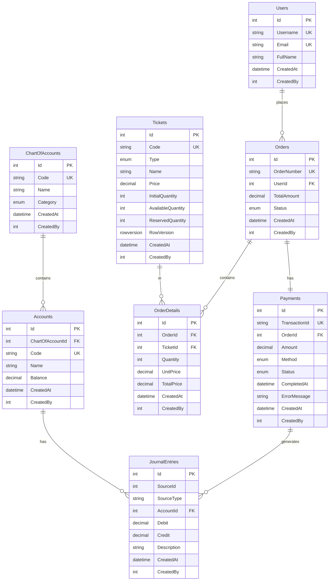

# 🎫 E-Ticketing & Payment Simulation Platform

A robust backend-focused e-ticketing system demonstrating **financial integrity**, **concurrency handling**, and **clean .NET Core architecture** with a **double-entry ledger system**.

## 📋 Table of Contents

- [Business Context](#business-context)
- [Technical Architecture](#technical-architecture)
- [Database Design (ERD)](#database-design-erd)
- [Key Features](#key-features)
- [Double-Entry Ledger Logic](#double-entry-ledger-logic)
- [Concurrency Handling](#concurrency-handling)
- [Setup Instructions](#setup-instructions)
- [API Documentation](#api-documentation)
- [Testing](#testing)

---

## 🎯 Business Context

An E-Ticketing & Payment Simulation Platform with three ticket types:
- **Gold**: 100 AED (Quota: 100 tickets)
- **Premium**: 200 AED (Quota: 50 tickets)
- **VIP**: 500 AED (Quota: 20 tickets)

### Payment Methods
1. **Credit Card**: Instant success simulation
2. **QR Scan**: 8-second delay simulation (pending → success)

---

## 🏗️ Technical Architecture

### Modular Monolith Structure
```
ETicketingSystem/
├── Accounting/           # Ledger & Financial Logic
│   ├── Entities/
│   └── Services/
├── Ticket/              # Ticket & Order Management
│   ├── Entities/
│   └── Services/
├── Payment/             # Payment Strategy Pattern
│   ├── Entities/
│   ├── Interfaces/
│   ├── Handlers/
│   └── Services/
├── Users/               # User Management
│   └── Entities/
├── Common/              # Shared Components
│   ├── BaseEntity.cs
│   └── Enums.cs
├── Data/                # DbContext & Seeding
│   ├── ApplicationDbContext.cs
│   └── DbInitializer.cs
└── Controllers/         # API Endpoints
```

### Technology Stack
- **Framework**: ASP.NET Core 8.0
- **Database**: SQL Server 2022
- **ORM**: Entity Framework Core (Code-First)
- **Frontend**: React 18
- **Containerization**: Docker & Docker Compose
- **CI/CD**: GitHub Actions

---

## 🗄️ Database Design (ERD)



---

## ✨ Key Features

### 1. **Double-Entry Ledger System** 📊
Every successful payment triggers dual journal entries:
- **Debit**: Cash/Payment Gateway Account (Asset ↑)
- **Credit**: Ticket Sales Revenue Account (Revenue ↑)

**Validation**: Total Debits = Total Credits (always balanced)

### 2. **Optimistic Concurrency Control** 🔒
Prevents race conditions when multiple users try to purchase the last ticket:
- Uses `RowVersion` (timestamp) on Ticket entity
- Automatic retry with exponential backoff (max 3 attempts)
- If ticket quantity changes between read and update, the transaction is retried

### 3. **Payment Strategy Pattern** 💳
Pluggable payment handlers:
```csharp
public interface IPaymentHandler
{
    PaymentMethod PaymentMethod { get; }
    Task<PaymentResult> ProcessPaymentAsync(Payment payment);
}
```
- **CreditCardHandler**: Instant processing
- **QRScanHandler**: 8-second async delay

### 4. **Data Integrity & ACID Transactions** 🛡️
```csharp
using var transaction = await _context.Database.BeginTransactionAsync();
try
{
    // 1. Reserve tickets (with concurrency check)
    // 2. Create order
    // 3. Process payment
    // 4. Record ledger entries
    // 5. Commit transaction
}
catch
{
    // Rollback everything if any step fails
    await transaction.RollbackAsync();
}
```

### 5. **Audit Trail** 📝
All entities inherit from `BaseEntity`:
```csharp
public abstract class BaseEntity
{
    public int Id { get; set; }
    public DateTime CreatedAt { get; set; }
    public int CreatedBy { get; set; }
    public DateTime? UpdatedAt { get; set; }
    public int? UpdatedBy { get; set; }
}
```

---

## 💰 Double-Entry Ledger Logic

### How the Ledger Stays Accurate

**Problem**: What if the API crashes mid-transaction?

**Solution**: Database Transactions + Atomicity

```csharp
public async Task<CheckoutResult> CreateOrderAndProcessPaymentAsync(...)
{
    using var transaction = await _context.Database.BeginTransactionAsync();
    
    try
    {
        // Step 1-6: Business logic...
        
        // Step 7: Record Ledger (happens INSIDE the transaction)
        await _ledgerService.RecordPaymentLedgerAsync(payment.Id, amount, method);
        
        await transaction.CommitAsync(); // All-or-nothing
    }
    catch
    {
        await transaction.RollbackAsync(); // Nothing is saved
        throw;
    }
}
```

### Chart of Accounts (Seeded)

| Code | Name                          | Category |
|------|-------------------------------|----------|
| 1000 | Assets                        | Asset    |
| 1100 | Cash - Credit Card            | Asset    |
| 1110 | Cash - QR Payment Gateway     | Asset    |
| 4000 | Revenue                       | Revenue  |
| 4100 | Ticket Sales Revenue          | Revenue  |

### Example Journal Entry

**Payment**: 500 AED via Credit Card

| Account Code | Account Name              | Debit | Credit |
|-------------|---------------------------|-------|--------|
| 1100        | Cash - Credit Card        | 500   | 0      |
| 4100        | Ticket Sales Revenue      | 0     | 500    |

**Result**: Total Debits (500) = Total Credits (500) ✅

---

## 🔒 Concurrency Handling

### The Race Condition Problem

Two users click "Buy" for the last Gold ticket at the exact same time. Without concurrency control, both could succeed, overselling the ticket.

### Solution: Optimistic Concurrency with RowVersion

```csharp
[Timestamp]
public uint RowVersion { get; set; }
```

**How it works:**
1. User A reads ticket (RowVersion = 1, Quantity = 1)
2. User B reads ticket (RowVersion = 1, Quantity = 1)
3. User A saves (RowVersion changes to 2, Quantity = 0)
4. User B tries to save → `DbUpdateConcurrencyException` thrown!
5. User B's transaction retries, sees Quantity = 0, returns "Sold Out"

**Code Implementation:**
```csharp
public async Task<bool> ReserveTicketsAsync(int ticketId, int quantity)
{
    var maxRetries = 3;
    var retryCount = 0;

    while (retryCount < maxRetries)
    {
        try
        {
            var ticket = await _context.Tickets.FindAsync(ticketId);
            
            if (ticket.AvailableQuantity < quantity)
                return false;

            ticket.AvailableQuantity -= quantity;
            ticket.ReservedQuantity += quantity;

            await _context.SaveChangesAsync(); // Throws if RowVersion changed
            return true;
        }
        catch (DbUpdateConcurrencyException)
        {
            retryCount++;
            await Task.Delay(100 * retryCount); // Exponential backoff
        }
    }
    
    throw new InvalidOperationException("High concurrency detected");
}
```

---

## 🚀 Setup Instructions

### Prerequisites
- Docker Desktop
- .NET 8.0 SDK (for local development)
- Node.js 18+ (for local frontend development)

### Quick Start (Docker Compose)

**Run the entire stack in under 5 minutes:**

```bash
# 1. Clone the repository
git clone <repository-url>
cd ETicketingSystem

# 2. Start all services (API + Database + Frontend)
docker-compose up --build

# Wait for services to start (about 2-3 minutes)
```

**Access the application:**
- **Frontend**: http://localhost:3000
- **API**: http://localhost:5000
- **Swagger**: http://localhost:5000/swagger

### Local Development Setup

#### Backend (.NET API)

```bash
cd ETicketingSystem

# Restore packages
dotnet restore

# Update connection string in appsettings.Development.json
# Ensure SQL Server is running on localhost:1433

# Apply migrations
dotnet ef database update

# Run the API
dotnet run
```

#### Frontend (React)

```bash
cd frontend

# Install dependencies
npm install

# Start development server
npm start
```

**The app will open at http://localhost:3000**

---

## 📚 API Documentation

### Tickets Endpoints

#### GET `/api/tickets`
Get all available tickets with current quantities.

**Response:**
```json
[
  {
    "id": 1,
    "code": "GOLD",
    "name": "Gold Ticket",
    "type": "Gold",
    "price": "100.00",
    "availableQuantity": 100,
    "initialQuantity": 100
  }
]
```

---

#### GET `/api/tickets/{id}`
Get specific ticket details.

---

### Orders Endpoints

#### POST `/api/orders/checkout`
Create order and process payment.

**Request:**
```json
{
  "items": [
    {
      "ticketId": 1,
      "quantity": 2
    }
  ],
  "paymentMethod": 1  // 1 = CreditCard, 2 = QRScan
}
```

**Response (Success):**
```json
{
  "success": true,
  "orderId": 1,
  "orderNumber": "ORD-20260328120000-A1B2C3D4",
  "transactionId": "TXN-20260328120000-E5F6G7H8",
  "totalAmount": "200.00",
  "completedAt": "2026-03-28T12:00:08Z",
  "message": "Payment processed successfully"
}
```

**Response (Failure):**
```json
{
  "message": "Not enough Gold tickets available. Only 1 left."
}
```

---

#### GET `/api/orders/{id}`
Get order details by ID.

---

#### GET `/api/orders/user/{userId}`
Get all orders for a specific user.

---

### Ledger Endpoints

#### GET `/api/ledger/summary`
Get ledger summary with all account balances.

**Response:**
```json
{
  "accounts": [
    {
      "code": "1100",
      "name": "Cash - Credit Card",
      "category": "Asset",
      "balance": 1500.00
    },
    {
      "code": "4100",
      "name": "Ticket Sales Revenue",
      "category": "Revenue",
      "balance": 1500.00
    }
  ],
  "totalDebits": 1500.00,
  "totalCredits": 1500.00,
  "isBalanced": true
}
```

---

#### GET `/api/ledger/validate`
Validate that the ledger is balanced.

**Response:**
```json
{
  "isBalanced": true,
  "message": "Ledger is balanced. Total Debits = Total Credits."
}
```

---

## 🧪 Testing

### Manual Testing Flow

1. **Open Frontend**: http://localhost:3000
2. **View Available Tickets**: All 3 ticket types displayed
3. **Add to Cart**: Select Gold (2x) and Premium (1x)
4. **Choose Payment Method**: 
   - Credit Card → Instant success
   - QR Scan → 8-second delay
5. **Checkout**: Click "Checkout" button
6. **Success Screen**: Shows Transaction ID and Timestamp
7. **Verify Ledger**: http://localhost:5000/api/ledger/summary
   - Check `isBalanced: true`
   - Verify account balances match total sales

### Concurrency Testing

**Scenario**: Test race condition handling

```bash
# Terminal 1: Buy last ticket
curl -X POST http://localhost:5000/api/orders/checkout \
  -H "Content-Type: application/json" \
  -d '{"items":[{"ticketId":1,"quantity":100}],"paymentMethod":1}'

# Terminal 2: Simultaneously buy the same ticket (should fail)
curl -X POST http://localhost:5000/api/orders/checkout \
  -H "Content-Type: application/json" \
  -d '{"items":[{"ticketId":1,"quantity":1}],"paymentMethod":1}'
```

**Expected**: Second request returns "Not enough tickets available"

---

## 📦 Project Structure Overview

```
ETicketingSystem/
├── docker-compose.yml          # Multi-container orchestration
├── Dockerfile.api              # Backend container
├── README.md                   # This file
├── .github/
│   └── workflows/
│       └── dotnet.yml          # CI/CD pipeline
├── ETicketingSystem/
│   ├── Program.cs              # Entry point & DI configuration
│   ├── appsettings.json        # Configuration
│   ├── Accounting/             # Financial module
│   ├── Ticket/                 # Ticketing module
│   ├── Payment/                # Payment module
│   ├── Users/                  # User module
│   ├── Common/                 # Shared code
│   ├── Data/                   # Database context
│   └── Controllers/            # API endpoints
└── frontend/
    ├── Dockerfile              # Frontend container
    ├── src/
    │   ├── App.js              # Main React component
    │   └── App.css             # Styles
    └── package.json
```

---

## 🎓 Evaluation Criteria Checklist

### ✅ Code Quality
- [x] Dependency Injection configured properly
- [x] Repository pattern (via EF Core DbContext)
- [x] Clean separation of concerns (Modular Monolith)
- [x] Meaningful variable/method names
- [x] SOLID principles applied

### ✅ Data Integrity
- [x] Ticket quota decreases correctly
- [x] Concurrency handled with optimistic locking
- [x] Double-entry ledger always balanced
- [x] Foreign key constraints enforced
- [x] No data deletion (status flags used)

### ✅ Problem Solving
- [x] 8-second QR delay implemented with async/await
- [x] Transaction rollback on payment failure
- [x] Race condition prevented with RowVersion
- [x] Exponential backoff retry mechanism

### ✅ Deployment & DevOps
- [x] Docker Compose for one-command startup
- [x] Database migrations on container start
- [x] Swagger API documentation
- [x] GitHub Actions CI/CD pipeline

---

## 📝 Design Decisions

### Why Modular Monolith?
- **Simplicity**: Easier to develop and deploy than microservices
- **Performance**: No network latency between modules
- **Transactions**: ACID guarantees across modules
- **Migration Path**: Can be split into microservices later if needed

### Why Optimistic Concurrency Over Pessimistic Locking?
- **Scalability**: No lock contention under normal load
- **User Experience**: No waiting for locks to release
- **Database Independence**: Works with any EF Core provider

### Why Strategy Pattern for Payments?
- **Extensibility**: Easy to add new payment methods (e.g., Wallet, Bank Transfer)
- **Testability**: Each handler can be tested independently
- **Maintainability**: Changes to one payment method don't affect others

---

## 🚧 Future Enhancements

- [ ] Unit tests for ledger logic (xUnit + Moq)
- [ ] Integration tests with TestContainers
- [ ] Redis caching for ticket availability
- [ ] Background job for QR payment processing (Hangfire)
- [ ] Authentication & Authorization (JWT)
- [ ] Event sourcing for audit trail
- [ ] Real-time ticket updates (SignalR)

---

## 👤 Author

**Technical Assessment Submission**  
Role: Backend / .NET Developer  
Date: March 28, 2026

---

## 📄 License

This is a technical assessment project for demonstration purposes.

---

## 🙏 Acknowledgments

- ASP.NET Core Team for excellent documentation
- Entity Framework Core for robust ORM
- Docker for containerization simplicity
- React community for frontend resources
