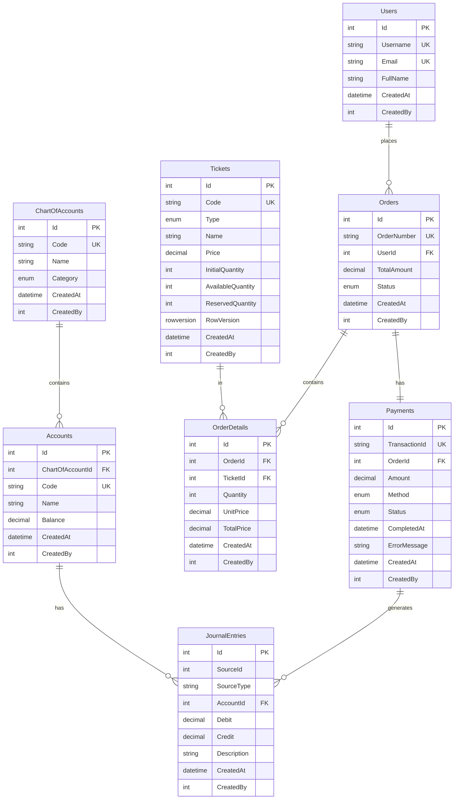
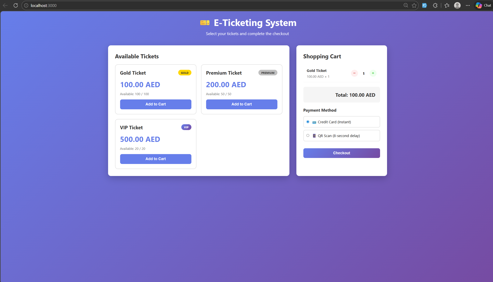

# 🎫 E-Ticketing & Payment Simulation Platform

A robust backend-focused e-ticketing system demonstrating **financial integrity**, **concurrency handling**, and **clean .NET Core architecture** with a **double-entry ledger system**.

## 🎯 Business Context

An E-Ticketing & Payment Simulation Platform with three ticket types:
- **Gold**: 100 AED (Quota: 100 tickets)
- **Premium**: 200 AED (Quota: 50 tickets)
- **VIP**: 500 AED (Quota: 20 tickets)

---

## 🏗️ Technical Architecture

### Modular Monolith Structure
```
ETicketingSystem/
├── Accounting/           # Ledger & Financial Logic
│   ├── Entities/
│   └── Services/
├── Ticket/              # Ticket & Order Management
│   ├── Entities/
│   └── Services/
├── Payment/             # Payment Strategy Pattern
│   ├── Entities/
│   ├── Interfaces/
│   ├── Handlers/
│   └── Services/
├── Users/               # User Management
│   └── Entities/
├── Common/              # Shared Components
│   ├── BaseEntity.cs
│   └── Enums.cs
├── Data/                # DbContext & Seeding
│   ├── ApplicationDbContext.cs
│   └── DbInitializer.cs
└── Controllers/         # API Endpoints
```

### Technology Stack
- **Framework**: ASP.NET Core 8.0
- **Database**: SQL Server 2022
- **ORM**: Entity Framework Core (Code-First)
- **Frontend**: React 18
- **Containerization**: Docker & Docker Compose
- **CI/CD**: GitHub Actions

---

## 🗄️ Database Design (ERD)



---

## ✨ Key Features

### 1. **Double-Entry Ledger System** 📊
Every successful payment triggers dual journal entries:
- **Debit**: Cash/Payment Gateway Account (Asset ↑)
- **Credit**: Ticket Sales Revenue Account (Revenue ↑)

**Validation**: Total Debits = Total Credits (always balanced)

### 2. **Optimistic Concurrency Control** 🔒
Prevents race conditions when multiple users try to purchase the last ticket:
- Uses `RowVersion` (timestamp) on Ticket entity
- Automatic retry with exponential backoff (max 3 attempts)
- If ticket quantity changes between read and update, the transaction is retried

### 3. **Payment Strategy Pattern** 💳
Pluggable payment handlers:
```csharp
public interface IPaymentHandler
{
    PaymentMethod PaymentMethod { get; }
    Task<PaymentResult> ProcessPaymentAsync(Payment payment);
}
```
- **CreditCardHandler**: Instant processing
- **QRScanHandler**: 8-second async delay

### 4. **Data Integrity & ACID Transactions** 🛡️

### 5. **Audit Trail** 📝
All entities inherit from `BaseEntity`:


## 🚀 Setup Instructions

### Prerequisites
- Docker Desktop
- .NET 8.0 SDK (for local development)
- Node.js 18+ (for local frontend development)

### Quick Start (Docker Compose)

**Run the entire stack in under 5 minutes:**

```bash
# 1. Clone the repository
git clone <repository-url>
cd ETicketingSystem

# 2. Start all services (API + Database + Frontend)
docker-compose up --build

# Wait for services to start (about 2-3 minutes)
```

**Access the application:**
- **Frontend**: http://localhost:3000
- **API**: http://localhost:5000
- **Swagger**: http://localhost:5000/swagger

**Application Screenshot:**



The frontend displays all three ticket types with real-time availability, shopping cart functionality, and a clean, responsive design.

**Important - Initialize Database:**
1. Open Swagger at http://localhost:5000/swagger
2. Find the `GET /api/database/migrate-and-seed` endpoint
3. Click "Try it out" → "Execute" to seed initial data (tickets, accounts, users)

### Local Development Setup

#### Backend (.NET API)

```bash
cd ETicketingSystem

# Restore packages
dotnet restore

# Update connection string in appsettings.Development.json
# Ensure SQL Server is running on localhost:1433

# Apply migrations
dotnet ef database update

# Run the API
dotnet run

# After API starts, visit http://localhost:5000/swagger
# Run GET /api/database/migrate-and-seed to initialize data
```

#### Frontend (React)

```bash
cd frontend

# Install dependencies
npm install

# Start development server
npm start
```

**The app will open at http://localhost:3000**


## 🧪 Testing

### Unit Tests

The project includes unit tests covering critical business logic. Run them with:

```bash
dotnet test ETicketingSystem.UnitTest/ETicketingSystem.UnitTest.csproj
```

**Test Coverage:**

1. **Ticket Concurrency Tests**
   - `ConcurrentBooking_TwoUsersForLastTickets_OnlyShouldSucceed` - Tests race condition when 2 users try booking the same last tickets simultaneously. Only one should succeed.

2. **Double-Entry Bookkeeping Tests**
   - `RecordPayment_ShouldCreateDoubleEntry` - Verifies that payment creates both debit and credit journal entries
   - `ValidateLedgerBalance_ShouldBeBalanced` - Ensures total debits equal total credits

3. **Payment Handler Tests**
   - `QRScan_ShouldTakeAtLeast8Seconds` - Confirms QR payment has 8 second delay
   - `CreditCardHandler_ShouldBeInstant` - Verifies credit card processes instantly

**Note**: Tests use in-memory database so they run fast without needing SQL Server.

---

## 📦 Project Structure Overview

```
ETicketingSystem/
├── docker-compose.yml          # Multi-container orchestration
├── Dockerfile.api              # Backend container
├── README.md                   # This file
├── .github/
│   └── workflows/
│       └── dotnet.yml          # CI/CD pipeline
├── ETicketingSystem/
│   ├── Program.cs              # Entry point & DI configuration
│   ├── appsettings.json        # Configuration
│   ├── Accounting/             # Financial module
│   ├── Ticket/                 # Ticketing module
│   ├── Payment/                # Payment module
│   ├── Users/                  # User module
│   ├── Common/                 # Shared code
│   ├── Data/                   # Database context
│   └── Controllers/            # API endpoints
└── frontend/
    ├── Dockerfile              # Frontend container
    ├── src/
    │   ├── App.js              # Main React component
    │   └── App.css             # Styles
    └── package.json
```

---

## 📝 Design Decisions

### Why Organized Folder Structure?
- **Simple Organization**: Code grouped by feature (Accounting, Payment, Ticket) for clarity
- **Single Project**: Everything in one ASP.NET Core project - no complex module boundaries
- **Easy to Navigate**: Related entities and services stay together
- **Good for Small Teams**: No need for full modular monolith or microservices at this scale

### Why Optimistic Concurrency Over Pessimistic Locking?
- **Scalability**: No lock contention under normal load
- **User Experience**: No waiting for locks to release
- **Database Independence**: Works with any EF Core provider

### Why Strategy Pattern for Payments?
- **Extensibility**: Easy to add new payment methods (e.g., Wallet, Bank Transfer)
- **Testability**: Each handler can be tested independently
- **Maintainability**: Changes to one payment method don't affect others


